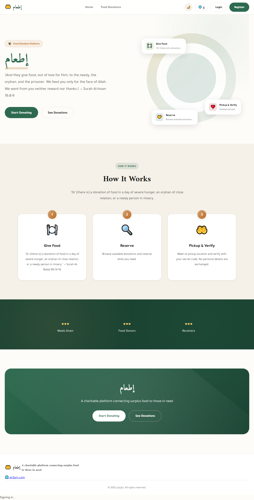

# Et3am (إطعام) - Food Donation Platform

<p align="center">
  
</p>

**English:** Connecting surplus food to families in need — free, open, and community-powered.  
**العربية:** نربط الطعام الفائض بالعائلات المحتاجة — مجاناً، مفتوح المصدر، ومُدار من المجتمع.

<p align="center">
  
  
  
  <a href="https://et3am.com"></a>
  <a href="https://opencollective.com/et3am"></a>
  <a href="https://github.com/sponsors/Amr1977"></a>
</p>

---

## 💡 Why Et3am?

- **Egypt wastes ~35%** of food produced annually
- **1 in 3 Egyptians** faces food insecurity
- **Et3am bridges this gap** with zero fees and no middlemen
- Inspired by the concept of **Sadaqah Jariyah** (continuous charity)

---

## 🌟 Features

- **Food Donation Listings** - Post and browse available food donations
- **Real-time Updates** - Live stats, map markers, and notifications
- **Secure Pickup** - Hash code verification for privacy
- **Push Notifications** - Stay informed about new donations
- **Admin Panel** - Manage users, donations, and reports
- **Multi-language** - Arabic and English support with RTL

---

## 🛠️ Tech Stack

| Component | Technology |
|-----------|------------|
| Frontend | React 18 + TypeScript + Vite |
| Backend | Express + TypeScript |
| Database | PostgreSQL (Neon/Supabase) |
| Real-time | Socket.io |
| Auth | JWT + Firebase |
| Maps | Leaflet + OpenStreetMap |
| Hosting | Firebase (Frontend), AWS/GCP (Backend) |

---

## 🚀 Quick Start

### Prerequisites

- Node.js 20+
- PostgreSQL (local or cloud)
- Firebase project

### Installation

```bash
# Clone the repository
git clone https://github.com/Amr1977/et3am.git
cd et3am

# Install backend dependencies
cd backend
npm install

# Install frontend dependencies
cd ../frontend
npm install

# Set up environment
cp backend/.env.example backend/.env
# Edit .env with your configuration
```

### Running Locally

```bash
# Terminal 1: Backend
cd backend
npm run dev

# Terminal 2: Frontend
cd frontend
npm run dev
```

- Frontend: http://localhost:5173
- Backend: http://localhost:3001

---

## 🤝 Contributing

We welcome contributions! Please see our [Contributing Guide](CONTRIBUTING.md) for details.

### How to Contribute

1. **Fork** the repository
2. **Create** a feature branch (`git checkout -b feature/amazing-feature`)
3. **Commit** your changes (`git commit -m 'feat: add amazing feature'`)
4. **Push** to the branch (`git push origin feature/amazing-feature`)
5. **Open** a Pull Request

Please read our [Code of Conduct](CODE_OF_CONDUCT.md) before contributing.

---

## 💰 Support the Project

If you believe in our mission, please consider supporting Et3am:

- **GitHub Sponsors:** https://github.com/sponsors/Amr1977
- **Open Collective:** https://opencollective.com/et3am
- **PayPal:** amr.lotfy.othman@gmail.com
- **Crypto (TRON TRC20):** TACcgwLC4GeKzKGLWz14tiVahnpftHre1H
- **InstaPay:** 01094450141

---

## 👥 Community

Join the conversation on [GitHub Discussions](https://github.com/Amr1977/et3am/discussions)!

---

## 📁 Project Structure

```
et3am/
├── backend/              # Express API server
│   ├── src/
│   │   ├── routes/      # API endpoints
│   │   ├── services/    # Business logic
│   │   ├── middleware/  # Auth, security
│   │   └── config/      # Configuration
│   └── tests/           # Integration tests
│
├── frontend/            # React application
│   ├── src/
│   │   ├── pages/       # Page components
│   │   ├── components/  # Reusable components
│   │   ├── context/     # React contexts
│   │   └── services/    # API calls
│   └── tests/           # E2E tests (Playwright)
│
├── docs/                # Documentation
└── .github/             # GitHub templates & workflows
```

---

## 📄 License

This project is licensed under the MIT License - see the [LICENSE](LICENSE) file for details.

---

## 📞 Contact

- **Email:** amr.lotfy.othman@gmail.com
- **Website:** https://et3am.com

---

## 🙏 Acknowledgments

- Inspired by the concept of Sadaqah Jariyah (continuous charity)
- Thanks to all contributors and supporters

---

<p align="center">Made with ❤️ for the community</p>